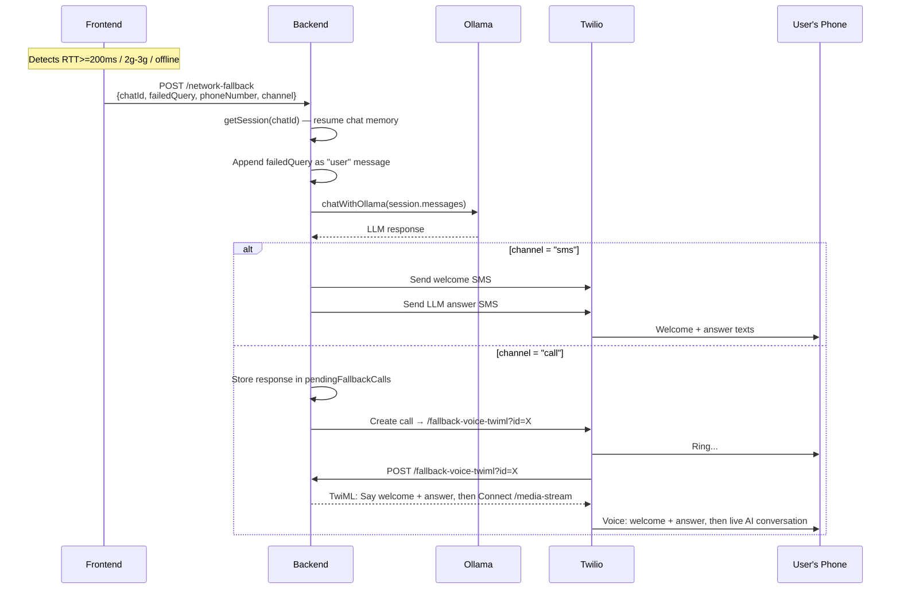

# Walkthrough — Network Fallback Backend

## What Changed

| File | Action | Purpose |
|---|---|---|
| [networkFallback.ts](file:///home/loki/Documents/projects/ai-voice-agent-with-twilio-elevenlabs-tutorial/src/networkFallback.ts) | **NEW** | `POST /network-fallback` endpoint + `POST /fallback-voice-twiml` TwiML webhook |
| [sms.ts](file:///home/loki/Documents/projects/ai-voice-agent-with-twilio-elevenlabs-tutorial/src/sms.ts) | Modified | Exported [getSession](file:///home/loki/Documents/projects/ai-voice-agent-with-twilio-elevenlabs-tutorial/src/sms.ts#21-32) for shared chat memory |
| [index.ts](file:///home/loki/Documents/projects/ai-voice-agent-with-twilio-elevenlabs-tutorial/src/index.ts) | Modified | Mounted `networkFallbackRouter`, added startup logs |

## How It Works



## API Contract

**`POST /network-fallback`**

```json
{
  "chatId": "+917550205578",
  "failedQuery": "What is the weather today?",
  "phoneNumber": "+917550205578",
  "channel": "sms"
}
```

Response:
```json
{
  "success": true,
  "channel": "sms",
  "phoneNumber": "+917550205578",
  "failedQuery": "What is the weather today?",
  "response": "The current weather in Chennai is..."
}
```

## Key Diffs

```diff:sms.ts
import { Request, Response, Router } from 'express';
import twilio from 'twilio';
import { chatWithOllama, OllamaMessage } from './llm';

// ─────────────────────────────────────────────
// Session store  (in-memory, per phone number)
// ─────────────────────────────────────────────

const SYSTEM_PROMPT = `You are a helpful AI assistant replying over SMS.
Keep your responses brief (2-3 sentences max) because they are delivered as text messages.
Be friendly, direct, and accurate.`;

interface SmsSession {
    messages: OllamaMessage[];
    lastActive: Date;
}

const sessions = new Map<string, SmsSession>();

function getSession(phoneNumber: string): SmsSession {
    if (!sessions.has(phoneNumber)) {
        sessions.set(phoneNumber, {
            messages: [{ role: 'system', content: SYSTEM_PROMPT }],
            lastActive: new Date(),
        });
    }
    const session = sessions.get(phoneNumber)!;
    session.lastActive = new Date();
    return session;
}

// Clean up sessions older than 1 hour
setInterval(() => {
    const oneHourAgo = new Date(Date.now() - 60 * 60 * 1000);
    for (const [key, session] of sessions.entries()) {
        if (session.lastActive < oneHourAgo) {
            sessions.delete(key);
            console.log(`🗑️ SMS session expired for ${key}`);
        }
    }
}, 10 * 60 * 1000); // check every 10 minutes


// ─────────────────────────────────────────────
// Inbound SMS Handler
// POST /sms-inbound  (Twilio webhook)
// ─────────────────────────────────────────────

async function handleInboundSms(req: Request, res: Response) {
    const from: string = req.body?.From ?? 'Unknown';
    const body: string = req.body?.Body ?? '';

    console.log(`📩 Inbound SMS from ${from}: "${body}"`);

    const twiml = new twilio.twiml.MessagingResponse();

    if (!body.trim()) {
        twiml.message('Hi! Send me a message and I\'ll do my best to help.');
        res.type('text/xml').send(twiml.toString());
        return;
    }

    const session = getSession(from);

    // Append the user's message to history
    session.messages.push({ role: 'user', content: body.trim() });

    try {
        const reply = await chatWithOllama(session.messages);
        console.log(`🤖 Agent reply to ${from}: "${reply}"`);

        // Append the assistant's reply to history
        session.messages.push({ role: 'assistant', content: reply });

        twiml.message(reply);
    } catch (err) {
        console.error('❌ Ollama error during SMS reply:', err);
        twiml.message('Sorry, I\'m having trouble right now. Please try again in a moment.');
    }

    res.type('text/xml').send(twiml.toString());
}


// ─────────────────────────────────────────────
// Outbound SMS  (agent initiates)
// ─────────────────────────────────────────────

/**
 * Send an outbound SMS from the AI agent to a user.
 * Records the message in the user's session so the conversation stays coherent.
 *
 * @param to      - Destination phone number (E.164 format, e.g. +917550205578)
 * @param message - The message the agent wants to send
 */
export async function sendOutboundSms(to: string, message: string): Promise<void> {
    const twilioClient = twilio(
        process.env.TWILIO_ACCOUNT_SID,
        process.env.TWILIO_AUTH_TOKEN
    );

    const from = process.env.TWILIO_PHONE_NUMBER!;

    // Record the outbound message in session so the next inbound reply has context
    const session = getSession(to);
    session.messages.push({ role: 'assistant', content: message });

    const result = await twilioClient.messages.create({ to, from, body: message });
    console.log(`📤 Outbound SMS sent to ${to}: "${message}" (SID: ${result.sid})`);
}


// ─────────────────────────────────────────────
// Express Router
// ─────────────────────────────────────────────

const smsRouter = Router();

// Twilio hits this when the user texts the Twilio number
smsRouter.post('/sms-inbound', handleInboundSms);

// Convenience endpoint to trigger an outbound SMS (for testing)
// GET /sms-outbound?to=+917550205578&message=Hello+from+AI
smsRouter.get('/sms-outbound', async (req: Request, res: Response) => {
    const to = (req.query.to as string) || process.env.MY_PHONE_NUMBER!;
    const message = (req.query.message as string) || 'Hello! This is your AI agent. How can I help you today?';

    try {
        await sendOutboundSms(to, message);
        res.json({ success: true, to, message });
    } catch (err: any) {
        console.error('❌ Outbound SMS error:', err);
        res.status(500).json({ success: false, error: err.message });
    }
});

export default smsRouter;
===
import { Request, Response, Router } from 'express';
import twilio from 'twilio';
import { chatWithOllama, OllamaMessage } from './llm';
import { hasPendingAddressRequest, handleAddressReply } from './addressSms';

// ─────────────────────────────────────────────
// Session store  (in-memory, per phone number)
// ─────────────────────────────────────────────

const SYSTEM_PROMPT = `You are a helpful AI assistant replying over SMS.
Keep your responses brief (2-3 sentences max) because they are delivered as text messages.
Be friendly, direct, and accurate.`;

interface SmsSession {
    messages: OllamaMessage[];
    lastActive: Date;
}

const sessions = new Map<string, SmsSession>();

export function getSession(phoneNumber: string): SmsSession {
    if (!sessions.has(phoneNumber)) {
        sessions.set(phoneNumber, {
            messages: [{ role: 'system', content: SYSTEM_PROMPT }],
            lastActive: new Date(),
        });
    }
    const session = sessions.get(phoneNumber)!;
    session.lastActive = new Date();
    return session;
}

// Clean up sessions older than 1 hour
setInterval(() => {
    const oneHourAgo = new Date(Date.now() - 60 * 60 * 1000);
    for (const [key, session] of sessions.entries()) {
        if (session.lastActive < oneHourAgo) {
            sessions.delete(key);
            console.log(`🗑️ SMS session expired for ${key}`);
        }
    }
}, 10 * 60 * 1000); // check every 10 minutes


// ─────────────────────────────────────────────
// Inbound SMS Handler
// POST /sms-inbound  (Twilio webhook)
// ─────────────────────────────────────────────

async function handleInboundSms(req: Request, res: Response) {
    const from: string = req.body?.From ?? 'Unknown';
    const body: string = req.body?.Body ?? '';

    console.log(`📩 Inbound SMS from ${from}: "${body}"`);

    const twiml = new twilio.twiml.MessagingResponse();

    if (!body.trim()) {
        twiml.message('Hi! Send me a message and I\'ll do my best to help.');
        res.type('text/xml').send(twiml.toString());
        return;
    }

    // ── Address reply interception ──────────────
    // If this number has a pending address request, treat the reply
    // as an address — do NOT forward it to the LLM chat session.
    if (hasPendingAddressRequest(from)) {
        const ack = handleAddressReply(from, body.trim());
        twiml.message(ack);
        res.type('text/xml').send(twiml.toString());
        return;
    }

    const session = getSession(from);

    // Append the user's message to history
    session.messages.push({ role: 'user', content: body.trim() });

    try {
        const reply = await chatWithOllama(session.messages);
        console.log(`🤖 Agent reply to ${from}: "${reply}"`);

        // Append the assistant's reply to history
        session.messages.push({ role: 'assistant', content: reply });

        twiml.message(reply);
    } catch (err) {
        console.error('❌ Ollama error during SMS reply:', err);
        twiml.message('Sorry, I\'m having trouble right now. Please try again in a moment.');
    }

    res.type('text/xml').send(twiml.toString());
}


// ─────────────────────────────────────────────
// Outbound SMS  (agent initiates)
// ─────────────────────────────────────────────

/**
 * Send an outbound SMS from the AI agent to a user.
 * Records the message in the user's session so the conversation stays coherent.
 *
 * @param to      - Destination phone number (E.164 format, e.g. +917550205578)
 * @param message - The message the agent wants to send
 */
export async function sendOutboundSms(to: string, message: string): Promise<void> {
    const twilioClient = twilio(
        process.env.TWILIO_ACCOUNT_SID,
        process.env.TWILIO_AUTH_TOKEN
    );

    const from = process.env.TWILIO_PHONE_NUMBER!;

    // Record the outbound message in session so the next inbound reply has context
    const session = getSession(to);
    session.messages.push({ role: 'assistant', content: message });

    const result = await twilioClient.messages.create({ to, from, body: message });
    console.log(`📤 Outbound SMS sent to ${to}: "${message}" (SID: ${result.sid})`);
}


// ─────────────────────────────────────────────
// Express Router
// ─────────────────────────────────────────────

const smsRouter = Router();

// Twilio hits this when the user texts the Twilio number
smsRouter.post('/sms-inbound', handleInboundSms);

// Convenience endpoint to trigger an outbound SMS (for testing)
// GET /sms-outbound?to=+917550205578&message=Hello+from+AI
smsRouter.get('/sms-outbound', async (req: Request, res: Response) => {
    const to = (req.query.to as string) || process.env.MY_PHONE_NUMBER!;
    const message = (req.query.message as string) || 'Hello! This is your AI agent. How can I help you today?';

    try {
        await sendOutboundSms(to, message);
        res.json({ success: true, to, message });
    } catch (err: any) {
        console.error('❌ Outbound SMS error:', err);
        res.status(500).json({ success: false, error: err.message });
    }
});

export default smsRouter;
```

```diff:index.ts
import "dotenv/config";
import express, { Request, Response } from "express";
import { createServer } from "http";
import { WebSocketServer, WebSocket } from "ws";
import twilio from "twilio";
import { connectToElevenLabs } from './llm';
import smsRouter from './sms';

const app = express();
const server = createServer(app);

// WebSocket server for Twilio media streams
const wss = new WebSocketServer({ server, path: "/media-stream" });

// Twilio client
const twilioClient = twilio(
    process.env.TWILIO_ACCOUNT_SID,
    process.env.TWILIO_AUTH_TOKEN
);

// Middleware
app.use(express.json());
app.use(express.urlencoded({ extended: true }));

// SMS Routes (Ollama-powered)
app.use('/', smsRouter);

// Health check
app.get("/", (req: Request, res: Response) => {
    res.send("AI Voice Agent Server Running");
});

// Twilio webhook - returns TwiML for the call
app.post("/voice", (req: Request, res: Response) => {
    const response = new twilio.twiml.VoiceResponse();

    // Say something first
    response.say("Hello! This is your AI voice agent. Let me connect you.");

    // Connect to bidirectional stream
    const connect = response.connect();
    connect.stream({
        url: `wss://${req.headers.host}/media-stream`
    });

    res.type("text/xml");
    res.send(response.toString());
});

// Inbound call webhook - Twilio hits this when someone calls your number
app.post("/incoming-call", (req: Request, res: Response) => {
    const callerNumber = req.body?.From || "Unknown";
    console.log(`📲 Incoming call from: ${callerNumber}`);

    const response = new twilio.twiml.VoiceResponse();
    response.say("Hello! Welcome. I am your AI assistant. How can I help you today?");

    const connect = response.connect();
    connect.stream({
        url: `wss://${req.headers.host}/media-stream`
    });

    res.type("text/xml");
    res.send(response.toString());
});

// Handle WebSocket connections from Twilio
wss.on('connection', handleTwilioConnection);


function handleTwilioConnection(twilioWs: WebSocket) {
    let streamSid: string | null = null;
    let elevenLabsWs: WebSocket | null = null;

    twilioWs.on('message', (data: string) => {
        const message = JSON.parse(data);

        switch (message.event) {
            case 'connected':
                console.log('📞 Twilio stream connected');
                break;

            case 'start':
                streamSid = message.start.streamSid;
                console.log('🎙️ Call started - StreamSid:', streamSid);

                // Connect to ElevenLabs
                elevenLabsWs = connectToElevenLabs(
                    process.env.ELEVENLABS_AGENT_ID!,
                    process.env.ELEVENLABS_API_KEY!
                );
                
                // Set up bidirectional audio bridge
                setupElevenLabsHandlers(elevenLabsWs, twilioWs, streamSid!);
                break;

            case 'media':
                // Forward caller's audio to ElevenLabs
                if (elevenLabsWs?.readyState === WebSocket.OPEN) {
                    elevenLabsWs.send(JSON.stringify({
                        user_audio_chunk: message.media.payload
                    }));
                }
                break;

            case 'stop':
                console.log('🛑 Call ended');
                elevenLabsWs?.close();
                break;
        }

    });


    twilioWs.on('close', () => {
        elevenLabsWs?.close();
    });
}

function setupElevenLabsHandlers(
    elevenLabsWs: WebSocket,
    twilioWs: WebSocket,
    streamSid: string
) {

    elevenLabsWs.on('message', (data: string) => {
        const message = JSON.parse(data);


        switch (message.type) {
            case 'audio':
                // Send AI audio back to caller
                if (message.audio_event?.audio_base_64) {
                    twilioWs.send(JSON.stringify({
                        event: 'media',
                        streamSid: streamSid,
                        media: {
                            payload: message.audio_event.audio_base_64
                        }
                    }));
                }
                break;

            case 'user_transcript':
                console.log('👤 User:', message.user_transcription_event.user_transcript
                );
                break;

            case 'agent_response':
                console.log('🤖 AI:', message.agent_response_event?.agent_response);
                break;

            case 'conversation_initiation_metadata':
                const meta = message.conversation_initiation_metadata_event;
                console.log(`✅ ElevenLabs ready (in: ${meta.user_input_audio_format}, out: ${meta.agent_output_audio_format})`);
                break;


        }
    });

    elevenLabsWs.on('error', (error) => {
        console.error('❌ ElevenLabs error:', error);
    });

    elevenLabsWs.on('close', () => {
        console.log('🔌 ElevenLabs disconnected');
    });
}

// Function to make outbound call
async function makeCall(to: string): Promise<void> {
    try {
        const call = await twilioClient.calls.create({
            to: to,
            from: process.env.TWILIO_PHONE_NUMBER!,
            url: `${process.env.NGROK_URL}/voice`,
        });
        console.log(`Call initiated! SID: ${call.sid}`);
    } catch (error) {
        console.error("Error making call:", error);
    }
}

// Endpoint to trigger the outbound call
app.get("/make-call", (req: Request, res: Response) => {
    makeCall(process.env.MY_PHONE_NUMBER!);
    res.send("Call initiated");
});

// Start server
const PORT = process.env.PORT || 3000;
server.listen(PORT, () => {
    console.log(`Server running on port ${PORT}`);
    console.log(`WebSocket endpoint: ws://localhost:${PORT}/media-stream`);
    console.log(`\n📞 Inbound call webhook:  ${process.env.NGROK_URL}/incoming-call`);
    console.log(`   → Configure in Twilio Console → "A call comes in"`);
    console.log(`\n💬 Inbound SMS webhook:   ${process.env.NGROK_URL}/sms-inbound`);
    console.log(`   → Configure in Twilio Console → "A message comes in"`);
    console.log(`\n📤 Outbound SMS trigger:  ${process.env.NGROK_URL}/sms-outbound?to=<phone>&message=<text>\n`);
});
===
import "dotenv/config";
import express, { Request, Response } from "express";
import { createServer } from "http";
import { WebSocketServer, WebSocket } from "ws";
import twilio from "twilio";
import { connectToElevenLabs } from './llm';
import smsRouter from './sms';
import addressSmsRouter from './addressSms';
import networkFallbackRouter from './networkFallback';

const app = express();
const server = createServer(app);

// WebSocket server for Twilio media streams
const wss = new WebSocketServer({ server, path: "/media-stream" });

// Twilio client
const twilioClient = twilio(
    process.env.TWILIO_ACCOUNT_SID,
    process.env.TWILIO_AUTH_TOKEN
);

// Middleware
app.use(express.json());
app.use(express.urlencoded({ extended: true }));

// SMS Routes (Ollama-powered)
app.use('/', smsRouter);

// Address collection SMS routes
app.use('/', addressSmsRouter);

// Network fallback routes (SMS/Call when frontend detects poor network)
app.use('/', networkFallbackRouter);

// Health check
app.get("/", (req: Request, res: Response) => {
    res.send("AI Voice Agent Server Running");
});

// Twilio webhook - returns TwiML for the call
app.post("/voice", (req: Request, res: Response) => {
    const response = new twilio.twiml.VoiceResponse();

    // Say something first
    response.say("Hello! This is your AI voice agent. Let me connect you.");

    // Connect to bidirectional stream
    const connect = response.connect();
    connect.stream({
        url: `wss://${req.headers.host}/media-stream`
    });

    res.type("text/xml");
    res.send(response.toString());
});

// Inbound call webhook - Twilio hits this when someone calls your number
app.post("/incoming-call", (req: Request, res: Response) => {
    const callerNumber = req.body?.From || "Unknown";
    console.log(`📲 Incoming call from: ${callerNumber}`);

    const response = new twilio.twiml.VoiceResponse();
    response.say("Hello! Welcome. I am your AI assistant. How can I help you today?");

    const connect = response.connect();
    connect.stream({
        url: `wss://${req.headers.host}/media-stream`
    });

    res.type("text/xml");
    res.send(response.toString());
});

// Handle WebSocket connections from Twilio
wss.on('connection', handleTwilioConnection);


function handleTwilioConnection(twilioWs: WebSocket) {
    let streamSid: string | null = null;
    let elevenLabsWs: WebSocket | null = null;

    twilioWs.on('message', (data: string) => {
        const message = JSON.parse(data);

        switch (message.event) {
            case 'connected':
                console.log('📞 Twilio stream connected');
                break;

            case 'start':
                streamSid = message.start.streamSid;
                console.log('🎙️ Call started - StreamSid:', streamSid);

                // Connect to ElevenLabs
                elevenLabsWs = connectToElevenLabs(
                    process.env.ELEVENLABS_AGENT_ID!,
                    process.env.ELEVENLABS_API_KEY!
                );
                
                // Set up bidirectional audio bridge
                setupElevenLabsHandlers(elevenLabsWs, twilioWs, streamSid!);
                break;

            case 'media':
                // Forward caller's audio to ElevenLabs
                if (elevenLabsWs?.readyState === WebSocket.OPEN) {
                    elevenLabsWs.send(JSON.stringify({
                        user_audio_chunk: message.media.payload
                    }));
                }
                break;

            case 'stop':
                console.log('🛑 Call ended');
                elevenLabsWs?.close();
                break;
        }

    });


    twilioWs.on('close', () => {
        elevenLabsWs?.close();
    });
}

function setupElevenLabsHandlers(
    elevenLabsWs: WebSocket,
    twilioWs: WebSocket,
    streamSid: string
) {

    elevenLabsWs.on('message', (data: string) => {
        const message = JSON.parse(data);


        switch (message.type) {
            case 'audio':
                // Send AI audio back to caller
                if (message.audio_event?.audio_base_64) {
                    twilioWs.send(JSON.stringify({
                        event: 'media',
                        streamSid: streamSid,
                        media: {
                            payload: message.audio_event.audio_base_64
                        }
                    }));
                }
                break;

            case 'user_transcript':
                console.log('👤 User:', message.user_transcription_event.user_transcript
                );
                break;

            case 'agent_response':
                console.log('🤖 AI:', message.agent_response_event?.agent_response);
                break;

            case 'conversation_initiation_metadata':
                const meta = message.conversation_initiation_metadata_event;
                console.log(`✅ ElevenLabs ready (in: ${meta.user_input_audio_format}, out: ${meta.agent_output_audio_format})`);
                break;


        }
    });

    elevenLabsWs.on('error', (error) => {
        console.error('❌ ElevenLabs error:', error);
    });

    elevenLabsWs.on('close', () => {
        console.log('🔌 ElevenLabs disconnected');
    });
}

// Function to make outbound call
async function makeCall(to: string): Promise<void> {
    try {
        const call = await twilioClient.calls.create({
            to: to,
            from: process.env.TWILIO_PHONE_NUMBER!,
            url: `${process.env.NGROK_URL}/voice`,
        });
        console.log(`Call initiated! SID: ${call.sid}`);
    } catch (error) {
        console.error("Error making call:", error);
    }
}

// Endpoint to trigger the outbound call
app.get("/make-call", (req: Request, res: Response) => {
    makeCall(process.env.MY_PHONE_NUMBER!);
    res.send("Call initiated");
});

// Start server
const PORT = process.env.PORT || 3000;
server.listen(PORT, () => {
    console.log(`Server running on port ${PORT}`);
    console.log(`WebSocket endpoint: ws://localhost:${PORT}/media-stream`);
    console.log(`\n📞 Inbound call webhook:  ${process.env.NGROK_URL}/incoming-call`);
    console.log(`   → Configure in Twilio Console → "A call comes in"`);
    console.log(`\n💬 Inbound SMS webhook:   ${process.env.NGROK_URL}/sms-inbound`);
    console.log(`   → Configure in Twilio Console → "A message comes in"`);
    console.log(`\n📤 Outbound SMS trigger:  ${process.env.NGROK_URL}/sms-outbound?to=<phone>&message=<text>`);
    console.log(`\n📍 Request address:       ${process.env.NGROK_URL}/request-address?to=<phone>`);
    console.log(`📍 Get stored address:    ${process.env.NGROK_URL}/stored-address?phone=<phone>`);
    console.log(`\n🌐 Network fallback:      POST ${process.env.NGROK_URL}/network-fallback\n`);
});
```

## Validation

- ✅ `npx tsc --noEmit` — zero errors

## Manual Testing

**SMS fallback:**
```bash
curl -X POST <NGROK_URL>/network-fallback \
  -H "Content-Type: application/json" \
  -d '{"chatId":"+917550205578","failedQuery":"What time is it?","phoneNumber":"+917550205578","channel":"sms"}'
```

**Call fallback:**
```bash
curl -X POST <NGROK_URL>/network-fallback \
  -H "Content-Type: application/json" \
  -d '{"chatId":"+917550205578","failedQuery":"What time is it?","phoneNumber":"+917550205578","channel":"call"}'
```
